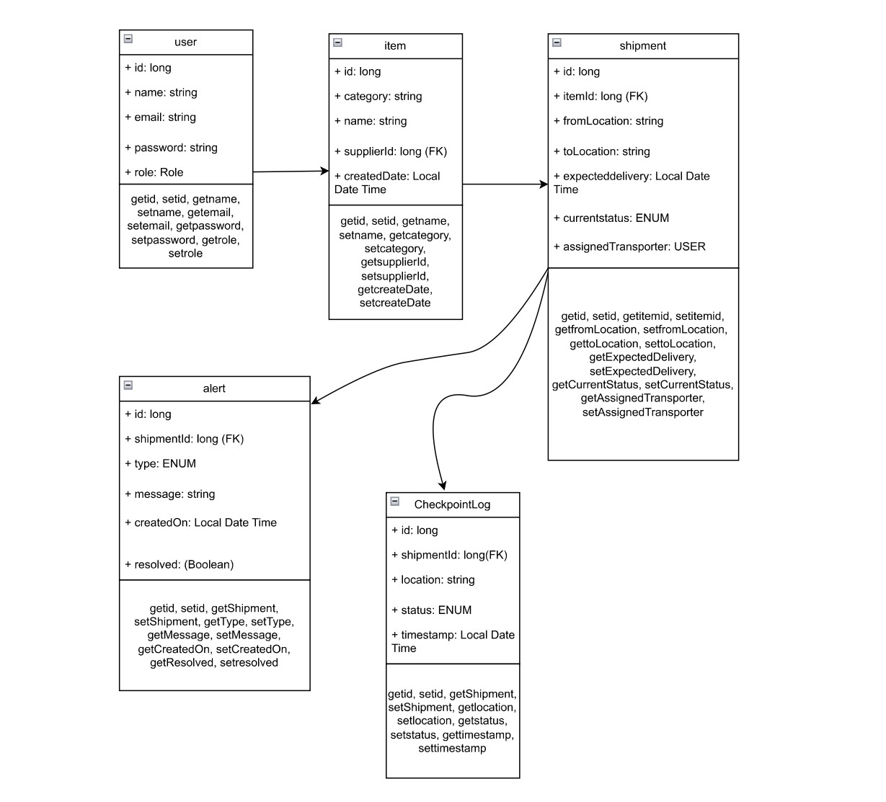

# 📦 Digital Supply Chain Tracker

A Spring Boot-based simulation project that digitally tracks and manages supply chain activities — from supplier to transporter to warehouse to retailer — ensuring visibility, transparency, and timely alerts.

## 🌐 Domain

Logistics / Manufacturing / Retail

---

## 🎯 Objectives

- Digitally track and monitor items across the supply chain.
- Record item statuses at every checkpoint.
- Provide role-based access to different users.
- Generate alerts for delays or damage.
- Offer real-time visibility with reports and dashboards.

---

## 🧱 Tech Stack

| Layer        | Technology                     |
|--------------|--------------------------------|
| Framework    | Spring Boot                    |
| Security     | Spring Security + JWT (optional) |
| Persistence  | Spring Data JPA                |
| Database     | MySQL                          |
| Build Tool   | Maven or Gradle                |
| Utilities    | Lombok, ModelMapper (optional) |
| Testing      | JUnit                          |
| Documentation| Swagger (springdoc-openapi)    |
| Optional     | JavaMailSender, Kafka, @Scheduled |

---

## 🧩 Key Modules

1. **User & Role Management**
2. **Item & Shipment Tracking**
3. **Checkpoints & Event Logs**
4. **Alerts & Notifications**
5. **Reporting & Analytics**

---

## 🔐 Roles & Access

| Role             | Access Description                                   |
|------------------|------------------------------------------------------|
| Admin            | Full access, manage users and roles, view reports    |
| Supplier         | Add items, create shipments                          |
| Transporter      | Update shipment and checkpoint status                |
| Warehouse Manager| Receive goods, confirm delivery                      |

---

## 🗃 Entity Overview

- **User**: id, name, email, password, role (ADMIN, SUPPLIER, TRANSPORTER, MANAGER)
- **Item**: id, name, category, supplierId, createdDate
- **Shipment**: id, itemId, fromLocation, toLocation, expectedDelivery, currentStatus, assignedTransporter
- **CheckpointLog**: id, shipmentId, location, status, timestamp
- **Alert**: id, shipmentId, type (DELAY, DAMAGE), message, createdOn, resolved

---

## 🔁 REST API Endpoints

### 🔐 AuthController

```
POST /api/auth/register  
POST /api/auth/login
```

### 👤 UserController (Admin)

```
GET /api/users  
PUT /api/users/{id}/role
```

### 📦 ItemController (Supplier/Admin)

```
POST /api/items  
GET /api/items  
GET /api/items/{id}
```

### 🚚 ShipmentController

```
POST /api/shipments  
PUT /api/shipments/{id}/assign  
GET /api/shipments  
GET /api/shipments/{id}  
PUT /api/shipments/{id}/status
```

### 📍 CheckpointLogController

```
POST /api/checkpoints  
GET /api/checkpoints/shipment/{id}
```

### 🚨 AlertController

```
GET /api/alerts  
PUT /api/alerts/{id}/resolve
```

### 📊 ReportController

```
GET /api/reports/delivery-performance  
GET /api/reports/delayed-shipments
```

---

## 🧪 Example Workflow

1. Supplier registers an item and creates a shipment.
2. Transporter updates shipment status and checkpoints.
3. System logs each event and detects delivery delays.
4. Alerts and reports are generated accordingly.

---

## 🖼 ER Diagram



---

## 🧭 Class Diagram


---

## ⚙ Sample Configuration (`application.properties`)

```properties
spring.datasource.url=jdbc:mysql://localhost:3306/supply_tracker  
spring.datasource.username=root  
spring.datasource.password=yourpassword  

spring.jpa.hibernate.ddl-auto=update  
spring.jpa.show-sql=true  

spring.security.jwt.secret=secretkey123  
spring.security.jwt.expiration=86400000
```

---

## 📁 Suggested Project Structure

```
com.supplytracker  
├── controller  
├── dto  
├── entity  
├── repository  
├── service  
├── config  
├── security  
├── scheduler (optional)  
├── exception  
└── SupplyTrackerApplication.java
```

---

## 🛠 Optional Enhancements

| Feature            | Technology             |
|--------------------|------------------------|
| Email alerts       | JavaMailSender         |
| Delay detection    | Scheduled jobs         |
| Real-time updates  | WebSocket / Kafka      |
| Dashboard UI       | Angular / React        |

---

## 🗂 Suggested Sprints

| Week | Deliverables                            |
|------|------------------------------------------|
| 1    | Setup project, user/role module, JWT     |
| 2    | Item and shipment management             |
| 3    | Checkpoint tracking, event logs          |
| 4    | Alerts and notifications module          |
| 5    | Reporting and dashboards                 |
| 6    | Testing, documentation, Swagger UI       |

---

## ▶️ How to Use the Project

### 🛠 Prerequisites

- Java 17+
- Maven or Gradle
- MySQL database
- (Optional) Postman for API testing
- (Optional) Swagger UI for API documentation

### 🚀 Steps to Run

1. **Clone the Repository**
   ```bash
   git clone https://github.com/your-username/digital-supply-chain-tracker.git
   cd digital-supply-chain-tracker
   ```

2. **Set up the Database**
   - Create a MySQL database named `supply_tracker`.
   - Update your `application.properties` file:
     ```properties
      spring.datasource.url=jdbc:mysql://10.9.215.64:3306/springboot_team_db
      spring.datasource.username=team_user
      spring.datasource.password=localpass123
     ```

3. **Build and Run the Application**
   Using Maven:
   ```bash
   ./mvnw clean install
   ./mvnw spring-boot:run
   ```

   Or using Gradle:
   ```bash
   ./gradlew build
   ./gradlew bootRun
   ```

4. **Access Swagger UI**  
   Visit `http://localhost:8080/swagger-ui.html` or `http://localhost:8080/swagger-ui/index.html`

5. **Register Users and Use API**  
   - Use `/api/auth/register` to create users with different roles.
   - Authenticate with `/api/auth/login` to get a JWT token.
   - Use the token in the `Authorization` header for secured endpoints.

6. **Explore API Endpoints**
   You can use Postman or Swagger UI to test endpoints like:
   - `/api/items`
   - `/api/shipments`
   - `/api/checkpoints`
   - `/api/alerts`
   - `/api/reports`

### 📌 Tips

- Add initial users and test data using Swagger or custom data.sql.
- You can customize roles, item categories, or statuses based on your domain logic.
- Monitor the console for real-time log updates.

---

## 👥 Authors

- [Nandini Deodia](https://github.com/nandinideodia) – Project Lead & Backend Developer
- [Piyush Hudda](https://github.com/piyushhudda) – Item and Shipment Tracking & Testing
- [Sai Varun](https://github.com/SaiVarun107) – Weekly Report Design & Exception Handling
- [Manchikanti Satya Koushik](https://github.com/satyakoushik1) – Alerts and Notifications & Database Design  
- [Spandan De Sarkar](https://github.com/SpandanDS) – User and Role Management & Testing
- [Shanmukh Billuri](https://github.com/shanmukhbillurii) – Alerts and Notifications & API Testing
- [Golla Hemanth](https://github.com/GOLLAG) – Checkpoints & Event Logs & Database Design


---

## 🤝 Contributors

Thanks to everyone who contributed through feedback, testing, or documentation.
